1. http://localhost:3000/
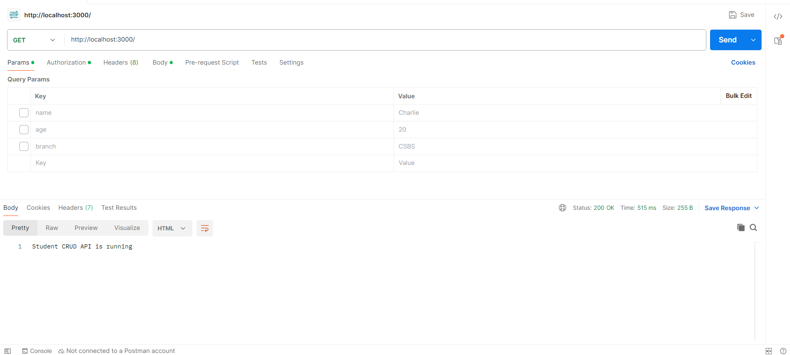

2. GET Request(All Students)
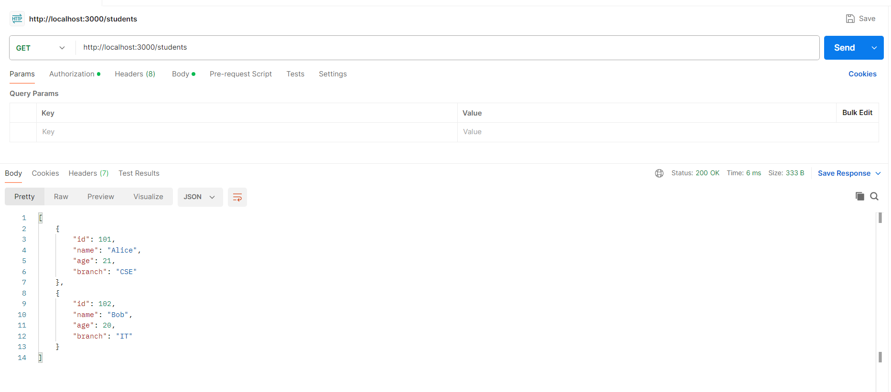

3. GET Requests (Get Student by ID)
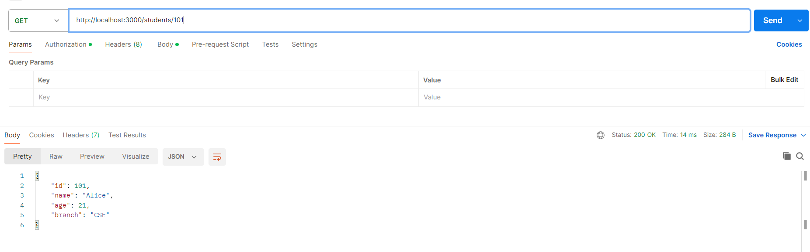

(Invalid GET Request Validation)
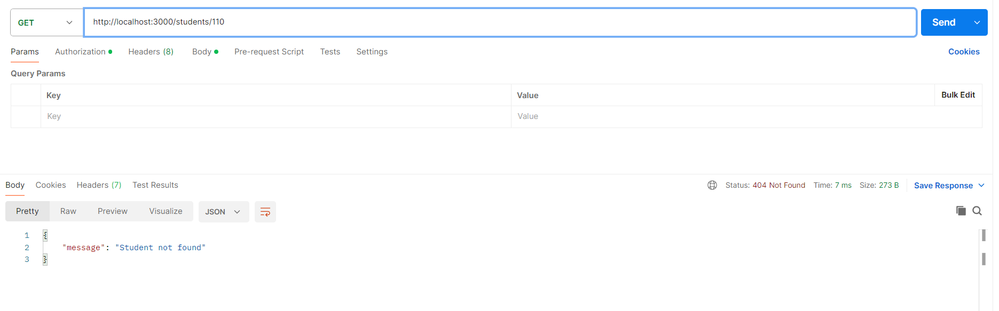

4. POST Requests (Add new Student)

Invalid Request:
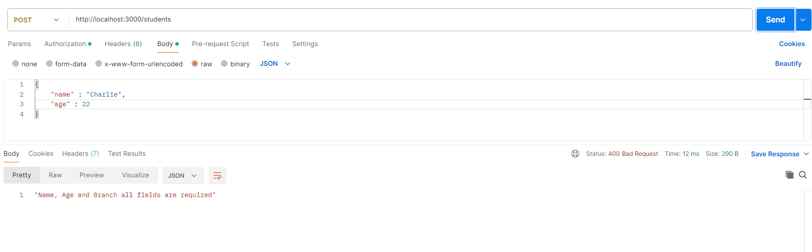

Correct Request:
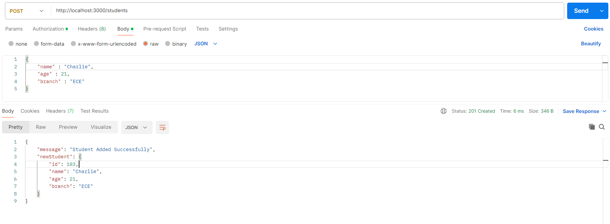

5. PUT Request(Update Student Details)

Invalid Request:
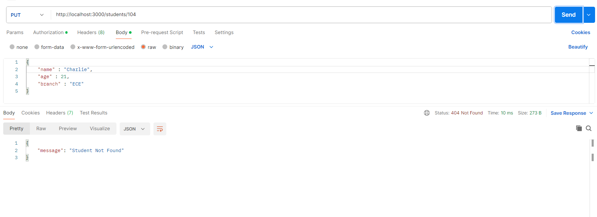

Correct Request:
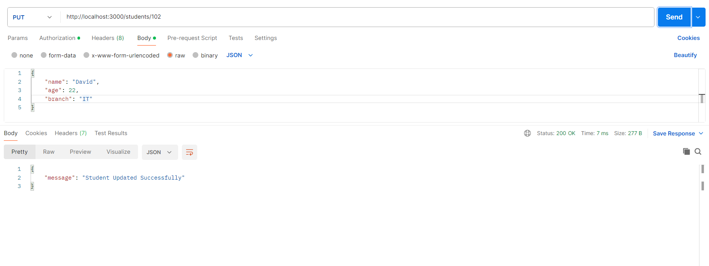

Old Student Data:
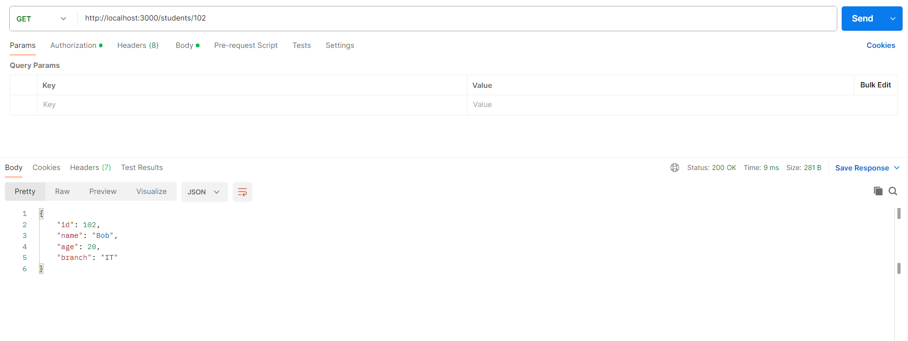
New Student Data:
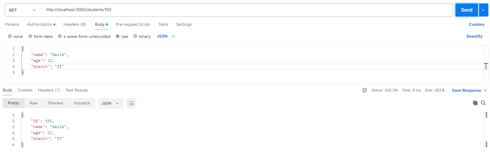

6. DELETE Request (Deleting a Student)
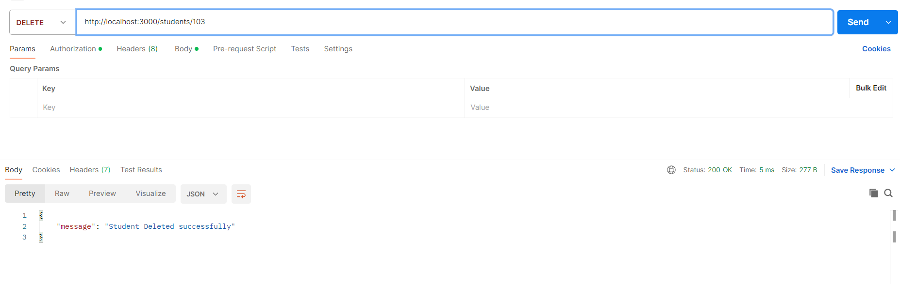
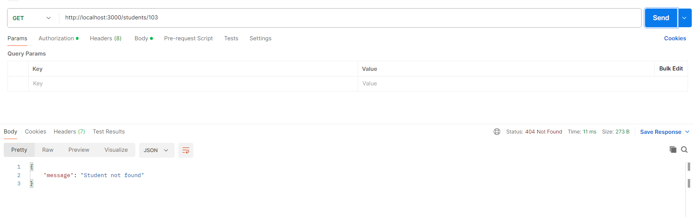